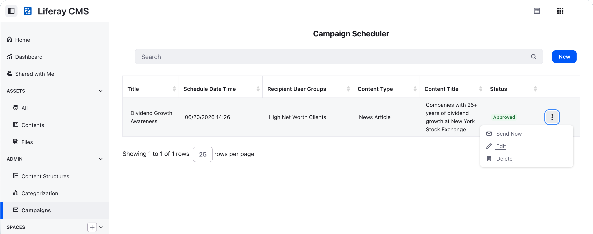
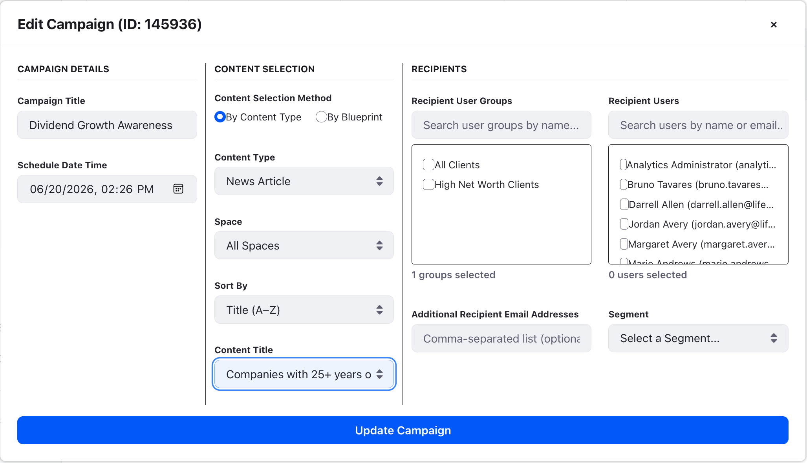

# Liferay Campaigns

A Liferay DXP demo that schedules and sends **tracked HTML email campaigns** from
content stored in Liferay Objects. A **Spring Boot microservice**
(`campaigns-microservice`) polls Liferay for campaigns that are due, resolves their
recipients and content over the headless REST APIs, renders the HTML (with
per-UserGroup conditional blocks and recipient merge fields), sends it over SMTP,
and embeds a tracking pixel that reports opens to Analytics Cloud.

It is packaged as a single Client Extension that runs as a workload on **Liferay
PaaS** (Liferay Cloud / LXC). Like the other demo microservices, it brokers its
Liferay calls over an OAuth2 user-agent application and reads all of its
deployment-specific settings from **environment variables** so the same build can
be promoted across environments without rebuilding.

## Screenshots





## Client Extension

| Extension | Purpose |
|---|---|
| `campaigns-microservice` | Spring Boot service that schedules campaigns, sends tracked HTML email over SMTP, serves the tracking pixel, and forwards open events to Analytics Cloud. Listens on port **58081** (`/ready` is the unauthenticated probe). |

## How campaigns are sent

A campaign reaches recipients in one of two ways, both running the same
server-side send routine:

- **Scheduled** — every 60 seconds the microservice polls Liferay (Basic Auth as
  `LIFERAY_EMAIL` / `LIFERAY_PASSWORD`) for campaigns whose `scheduledSendDate`
  falls in the current minute, and sends them.
- **On demand** — the **Send Now** action in the campaign UI calls
  `POST /send-email/{campaignId}` with the signed-in user's OAuth2 bearer token.
  The service re-fetches that campaign from Liferay using the caller's token, so
  access is enforced by Liferay: only a campaign the caller is allowed to see,
  and that is in the **Approved** state, is sent. The recipients and content are
  taken from the fetched record, never from the request body.

## Building & Deploying

The Client Extension builds and deploys from the `liferay-campaigns`
workspace:

```bash
cd client-extensions/campaigns-microservice
blade gw clean build && lcp deploy --extension dist/*.zip
```

For **local** development you can run the microservice directly:

```bash
cd client-extensions/campaigns-microservice
blade gw bootRun
```

It listens on port **58081**; hit `http://localhost:58081/ready` to confirm it is
up.

## Configure the Microservice Environment

Every deployment-specific setting is read from an environment variable with a
default baked into
[`application-default.properties`](client-extensions/campaigns-microservice/src/main/resources/application-default.properties).
For **local** runs, copy the example file and fill in the values — `run-local.sh`
sources it automatically:

```bash
cp client-extensions/campaigns-microservice/.env.example client-extensions/campaigns-microservice/.env
```

At runtime Spring Boot layers these on top of the defaults through the
`configtree` import wired in
[`application.properties`](client-extensions/campaigns-microservice/src/main/resources/application.properties),
so the same build can be promoted across environments without rebuilding.

> **Treat passwords and the encryption secret as secrets.** `SPRING_MAIL_PASSWORD`,
> `LIFERAY_PASSWORD`, and `TRACKING_PIXEL_SECRET` are sensitive — store them as
> **secrets**, not plain environment variables, and never commit them. The two
> passwords default to empty, and the feature that needs each is simply skipped
> (scheduler) or fails to authenticate (mail) when it is unset; `TRACKING_PIXEL_SECRET`
> is the AES-GCM key for the open-tracking token, and when it is empty the pixel
> endpoint fails closed (open events are dropped).

| Variable | Required | Default | Description |
|---|---|---|---|
| `LIFERAY_BASE_URL` | No | `https://webserver-lctfootrial-prd.lfr.cloud` | Base URL of the Liferay instance the scheduler queries (`/o/c/campaigns/`); also the host the JWKS endpoint is derived from. Point this at your environment's web server. |
| `LIFERAY_EMAIL` | **Yes** (to schedule) | `test@liferay.com` | Liferay user the scheduler authenticates as (Basic Auth). Needs read access to the campaign and content Objects. **If `LIFERAY_EMAIL` or `LIFERAY_PASSWORD` is empty, the 60s scheduler poll is skipped entirely.** |
| `LIFERAY_PASSWORD` | **Yes** (to schedule) | *(empty)* | Password for `LIFERAY_EMAIL`. Store as a secret. Empty disables the scheduler. |
| `LIFERAY_HEADLESS_API_BASE_URL` | No | `https://webserver-lctfootrial-prd.lfr.cloud/o` | Base URL (note trailing `/o`) for headless REST calls during campaign execution. |
| `EMAIL_FRIENDLY_URL_BASE_URL` | No | `https://webserver-lctfootrial-prd.lfr.cloud` | Public-facing base URL used to build "View in Portal" friendly-URL links embedded in emails. |
| `TRACKING_PIXEL_BASE_URL` | No | `https://campaignsmicroservice-lctfootrial-prd.lfr.cloud/` | Public base URL of *this* service, embedded in the tracking-pixel `` of every sent email (local: `http://localhost:58081`). |
| `TRACKING_PIXEL_SECRET` | **Yes** (to track) | *(empty)* | Shared secret used to **encrypt** the tracking-pixel URL parameters (AES-GCM). It gives the public, unauthenticated endpoint two guarantees at once: the recipient email address and campaign/content metadata stay **private** (carried as a single encrypted token, never cleartext) and every accepted open event is **provably genuine** (forged or tampered tokens fail to decrypt and are dropped). Store as a secret; must be **identical across all replicas**. When empty the endpoint **fails closed and drops all open events** (a startup error is logged) unless `TRACKING_PIXEL_ALLOW_UNSIGNED=true`. |
| `TRACKING_PIXEL_ALLOW_UNSIGNED` | No | `false` | When no secret is set, accept cleartext, unauthenticated open events (the email address then appears in the URL). Defaults to `false` (fail closed) — the safe production behavior. Set `true` **only for local development**; it trades away the privacy and authenticity guarantees above. |
| `TRACKING_PIXEL_MAX_AGE_DAYS` | No | `90` | How long a tracking-pixel token stays valid, in days, keeping a captured URL from being replayed indefinitely. `0` (or negative) disables the freshness check. |
| `CORS_ALLOWED_ORIGIN_PATTERNS` | **Yes** (on PaaS) | `*` | Comma-separated CORS origin patterns for browser callers. The default `*` is for local dev only — **scope it on PaaS** (e.g. `https://*.lfr.cloud`) so the deployed service accepts browser calls only from your own origins. |
| `SPRING_MAIL_HOST` | No | `smtp.gmail.com` | SMTP server hostname. |
| `SPRING_MAIL_PORT` | No | `587` | SMTP port (STARTTLS is enabled). |
| `SPRING_MAIL_USERNAME` | No | `noreply@example.com` | SMTP account / From address. |
| `SPRING_MAIL_PASSWORD` | **Yes** (to send) | *(empty)* | SMTP password or app password. Store as a secret. With the default empty value sends fail to authenticate. |
| `ANALYTICS_ENDPOINT_URL` | No | `https://osbasahpublisher-ac-uswest1.lfr.cloud/` | Analytics Cloud (Asah) publisher endpoint the tracking pixel forwards open events to. |
| `ANALYTICS_PROJECT_ID` | **Yes** (to track) | `REPLACE_WITH_PROJECT_ID` | Analytics Cloud project ID. Find it on the `OSB-Asah-Project-ID` header of Analytics XHR requests in the browser Network tab. With the default sentinel value, open tracking is skipped. |
| `ANALYTICS_DATASOURCE_ID` | **Yes** (to track) | *(empty)* | Analytics data source ID, the `dataSourceId` attribute in the same Analytics XHR payload. |
| `ANALYTICS_CHANNEL_ID` | **Yes** (to track) | *(empty)* | Analytics channel ID, the `channelId` attribute in the same Analytics XHR payload. |
| `REST_CLIENT_CONNECT_TIMEOUT_MILLIS` | No | `5000` | Connect timeout (ms) for the shared outbound HTTP client used for all calls to Liferay and Analytics Cloud. |
| `REST_CLIENT_READ_TIMEOUT_MILLIS` | No | `10000` | Read timeout (ms) for the shared outbound HTTP client used for all calls to Liferay and Analytics Cloud. |
| `CAMPAIGNS_LOG_LEVEL` | No | `INFO` | Log level for this service's own packages. Keep at `INFO` in production; `DEBUG` emits PII-bearing analytics payloads and full tracking URLs, so enable it only in a controlled environment. |

### Deploying to Liferay PaaS

For Liferay Cloud (PaaS/LXC) deployments, set the same variables on the
`campaignsmicroservice` service under **Environment Variables** in the Liferay
Cloud console (or with the `lcp`/`lcc` CLI) instead of the local `.env` file. The
PaaS runtime also injects `LIFERAY_ROUTES_CLIENT_EXTENSION`
(`/etc/liferay/lxc/ext-init-metadata`) and `LIFERAY_ROUTES_DXP`
(`/etc/liferay/lxc/dxp-metadata`) automatically from
[`LCP.json`](client-extensions/campaigns-microservice/LCP.json) — these locate the
OAuth2 / DXP metadata config trees and do not need to be set manually.

> The OAuth2 JWKS endpoint
> (`security.oauth2.resourceserver.jwk.jwk-set-uri`) is derived from
> `LIFERAY_BASE_URL` and so follows it automatically. Display-page "View in
> Portal" URLs are resolved dynamically at runtime by `DisplayPageUrlService`
> (no per-type URL pattern to configure).

## OAuth application

The microservice calls Liferay through the user-agent OAuth2 application defined
in
[`client-extension.yaml`](client-extensions/campaigns-microservice/client-extension.yaml)
(`liferay-campaigns-oauth-application-user-agent`). It is granted read scopes
on the `c_newsarticle` content Object plus
`Liferay.Headless.Admin.User`, `Liferay.Object.Admin.REST`, and
`Liferay.Portal.Search.REST`. The scheduler additionally authenticates with Basic
Auth (`LIFERAY_EMAIL` / `LIFERAY_PASSWORD`) for its polling queries.
